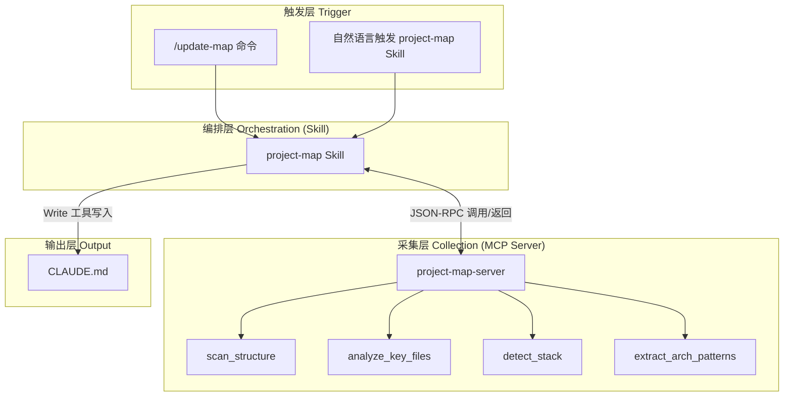
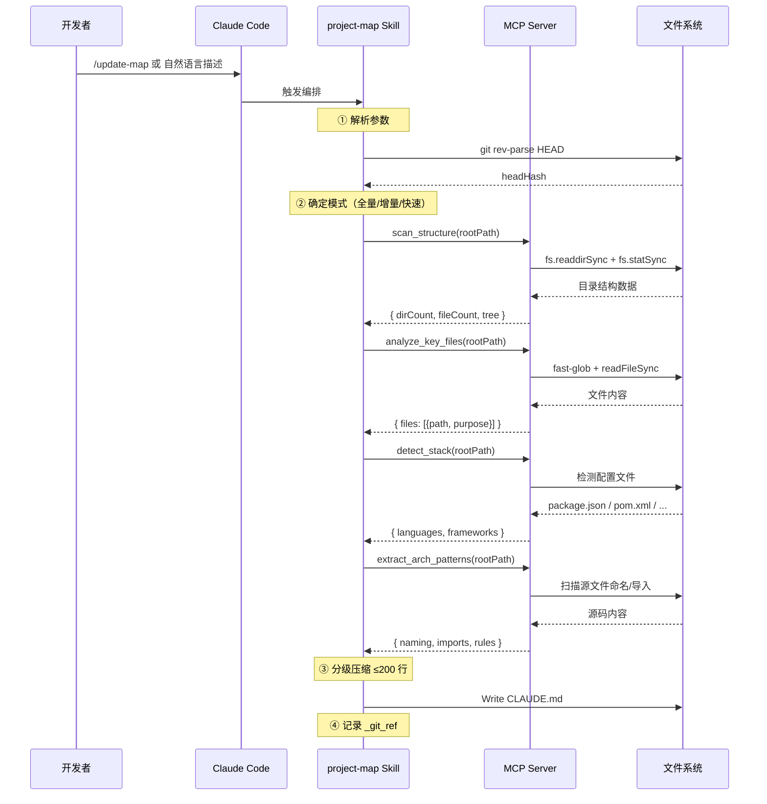
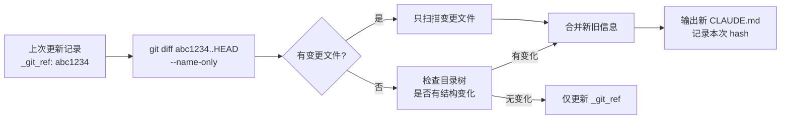

# Project Map 自动维护系统 — 设计方案

> **让 AI 编程助手始终理解你的项目结构，无需手动维护。**

<div align="center">


</div>

---

## 目录

- [执行摘要](#执行摘要)
- [1. 背景与问题](#1-背景与问题)
- [2. 设计目标](#2-设计目标)
- [3. 系统架构](#3-系统架构)
  - [3.1 三层分离](#31-三层分离)
  - [3.2 技术决策：为何选择 MCP Server 而非纯 Skill](#32-技术决策为何选择-mcp-server-而非纯-skill)
  - [3.3 采集层详解（MCP Server）](#33-采集层详解mcp-server)
  - [3.4 编排层详解（Skill）](#34-编排层详解skill)
  - [3.5 完整链路](#35-完整链路)
- [4. 增量更新策略](#4-增量更新策略)
- [5. 分级输出策略](#5-分级输出策略)
- [6. 架构变更检测](#6-架构变更检测)
- [7. Monorepo 支持方案](#7-monorepo-支持方案)
- [8. 输出约束与格式约定](#8-输出约束与格式约定)
- [9. 后续迭代方向](#9-后续迭代方向)
- [10. 贡献指南](#10-贡献指南)

---

## 执行摘要

本系统解决一个具体问题：**AI 编程助手（Claude）每次对话不知道项目结构，需要盲目读取大量文件来理解代码，既浪费 token（API 费用），又导致生成的代码风格不一致。**

方案是自动维护一份项目地图文件 `CLAUDE.md`，Claude 每次启动自动读取。系统通过 **MCP Server（采集层）→ Skill（编排层）→ CLAUDE.md（输出层）** 三层架构、git 增量扫描、按规模分级输出等机制，保证这份地图始终与代码同步，且更新开销极低。

<table>
<tr>
  <td>🎯 <strong>核心收益</strong></td>
  <td>📊 <strong>量化指标</strong></td>
  <td>🔧 <strong>实现方式</strong></td>
</tr>
<tr>
  <td>Token 消耗降低</td>
  <td><code>~95%</code> 增量模式跳过未变更文件</td>
  <td>git diff 增量扫描</td>
</tr>
<tr>
  <td>项目规范传承</td>
  <td>每次 Claude 遵循已有架构约定</td>
  <td>CLAUDE.md 自动读取</td>
</tr>
<tr>
  <td>零手动维护</td>
  <td>代码变更 → 地图自动同步</td>
  <td>Skill 编排 + MCP 采集</td>
</tr>
</table>

---

## 1. 背景与问题

### 1.1 什么是 CLAUDE.md

`CLAUDE.md` 是放在项目根目录的一份 Markdown 文件，Claude（AI 编程助手）每次对话启动时自动读取。它的作用类似**项目地图**：告诉 Claude 项目结构、技术栈、关键文件位置、架构约定。

### 1.2 没有项目地图的后果

Claude 不了解项目上下文。用户提需求后，Claude 只能**盲目搜索**——读 `package.json` 看依赖、扫目录看结构、读文件猜用途。导致三个问题：

> ⚠️ **问题 1 — 烧 token，烧钱。** 每次对话花大量 token 在"摸索结构"上，而非解决实际需求。
>
> ⚠️ **问题 2 — 代码风格割裂。** 每次对话不知道项目约定，生成的代码风格前后不一致。
>
> ⚠️ **问题 3 — 跨模块困难。** 不知道相关文件在哪，反复扫目录，影响回答质量。

### 1.3 核心矛盾

CLAUDE.md 有效的前提是**与代码同步**。一旦过时，反而误导 Claude。但手动维护 CLAUDE.md 是额外负担，迭代中容易被忽略。

> 💡 **核心问题：** CLAUDE.md 需要持续更新，但手动维护成本高、容易遗忘。

### 1.4 解决思路

构建自动化系统：代码变更后自动检测变化、更新 CLAUDE.md，无需人工介入。

---

## 2. 设计目标

| 目标 | 说明 | 衡量标准 |
|:-----|:------|:----------|
| **🔄 零手动维护** | CLAUDE.md 完全自动更新 | 开发者无需手动编辑 |
| **📦 轻量输出** | 不占据对话上下文预算 | 始终 ≤200 行 |
| **📐 规模自适应** | 小项目和大项目都适用 | 100 到 10000+ 文件均有合理输出 |
| **⚡ 低成本更新** | 更新本身的 token 开销低 | 增量模式跳过 ≥95% 未变更文件 |
| **🏗️ 架构感知** | 识别架构变化并反馈 | 目录移动/新增时发出告警 |
| **🔒 只读安全** | 不向外发送数据 | 零网络调用，纯本地扫描 |

---

## 3. 系统架构

### 3.1 三层分离

系统采用三层架构，按读写权限和数据变换链路组织：



> 🏛️ **设计原则：读写分离。** 采集层只读不写，编排层控制写入。降低耦合，每层可独立测试。

### 3.2 技术决策：为何选择 MCP Server 而非纯 Skill

> **这是系统最核心的架构决策之一。** 很多开发者会问："文件扫描分析这些事，用 Skill 让 Claude 自己执行不就行了？为什么还要额外起一个 MCP Server？"
>
> 答案要从 **Token 成本、确定性、职责边界** 三个维度理解。

#### 3.2.1 直觉 vs 现实

```text
❌ 直觉：Skill 就够了吧，Claude 可以直接跑 bash 读文件
✅ 现实：纯 Skill 方案有 4 个致命问题
```

#### 3.2.2 Token 爆炸对比

以一次全量更新为例，`extract_arch_patterns` 需要 glob 源文件 → 读内容 → 分析命名模式：

| 方案 | 操作 | Token 消耗 | 耗时 |
|:-----|:------|:-----------|:-----|
| **纯 Skill** | Claude 读 `src/**/*.ts` → 逐个 Read 文件 → 自行归纳命名规则 | **~50,000+**（上千文件读入 context） | 慢 |
| **MCP Server** | Node.js glob + readFileSync → 返回结构化 JSON | **~300**（仅接收摘要结果） | 毫秒级 |

差异接近 **两个数量级**。MCP server 把「读几百个文件做分析」压缩成「一次 tool call 返回结构化摘要」。

#### 3.2.3 确定性对比

MCP 工具是编译/解释执行的代码：

```
scan_structure({ rootPath, maxDepth: 4, excludePatterns: ["node_modules"] })
→ 永远返回同样的 JSON 结构
```

纯 Skill 用自然语言描述「扫描目录树深度 ≤4 排除 node_modules」：

```
→ Claude 每次执行可能不一样
→ find flags 记错、深度忘限制、漏排除
→ 输出格式不统一，后续处理困难
```

#### 3.2.4 决策对照表

<table>
<tr>
  <th>维度</th>
  <th>纯 Skill 方案</th>
  <th>MCP Server 方案 ✅</th>
</tr>
<tr>
  <td><strong>Token 效率</strong></td>
  <td>❌ 大量文件内容占满 context window</td>
  <td>✅ 预消化为 JSON 摘要，单位 token 承载 100x 信息</td>
</tr>
<tr>
  <td><strong>确定性</strong></td>
  <td>❌ 自然语言指令 → 执行结果不稳定</td>
  <td>✅ 代码执行 → 相同输入永远相同输出</td>
</tr>
<tr>
  <td><strong>数据结构</strong></td>
  <td>❌ 解析 bash 输出，格式松散</td>
  <td>✅ typed JSON Schema，Claude 直接解构使用</td>
</tr>
<tr>
  <td><strong>职责边界</strong></td>
  <td>❌ 文件 I/O + 决策 + 写入混杂</td>
  <td>✅ MCP 做文件 I/O，Skill 做决策写入</td>
</tr>
<tr>
  <td><strong>性能</strong></td>
  <td>❌ 每次调 bash，启动 shell + 解析输出</td>
  <td>✅ Node.js 常驻进程，毫秒级响应</td>
</tr>
<tr>
  <td><strong>可复用性</strong></td>
  <td>❌ 扫描逻辑嵌在 Skill 文本中</td>
  <td>✅ MCP 工具可被任意 Skill 调用</td>
</tr>
</table>

#### 3.2.5 结论

> **MCP Server 把「计算密集、重复性强」的文件扫描工作从 LLM 的 context 中剥离，交给确定性代码执行。Skill 只做「需要判断力」的编排、合并、压缩和写入。这是系统能在 token 预算内完成全量更新的根本保证。**

💡 **类比：** MCP Server 像数据库引擎（执行查询返回结果），Skill 像应用层（决定查什么、怎么用结果）。如果让应用层自己去扫表，既慢又不稳定。

---

### 3.3 采集层详解（MCP Server）

采集层由独立 Node.js 进程运行，通过 **stdin/stdout**（MCP StdioTransport）与 Claude 通信。**零网络端口，纯本地通信。**

#### 采集工具清单

| 工具 | 采集内容 | 输出示例 | 用途 |
|:-----|:---------|:---------|:-----|
| `scan_structure` | 递归目录树 | `{ dirCount: 12, fileCount: 342, tree: [...] }` | 生成文件结构概览 |
| `analyze_key_files` | 关键文件 exports 和用途 | `{ files: [{ path, purpose, keyLines }] }` | 确定 Key Files 列表 |
| `detect_stack` | 技术栈识别 | `{ languages: ["TS","Java"], frameworks: ["React"] }` | 确定框架和语言 |
| `extract_arch_patterns` | 命名规范和导入依赖 | `{ naming, imports, rules }` | 推断架构规则 |

所有工具通过 `rootPath` 参数同时支持 **根目录** 和 **子包** 两种模式，同一模块两处复用。

#### 工作原理

```text
Claude Code 进程                    MCP Server（子进程）
    │                                      │
    │── JSON-RPC: call_tool(name, args) ──→│
    │                                      │── fs.readdirSync / fg()
    │                                      │── fs.readFileSync()
    │                                      │── 分析/聚合
    │←── JSON-RPC: result (structured) ────│
    │                                      │
```

#### LanguageProvider 接口体系

每种编程语言以独立模块接入，通过 registry 注册：

```text
providers/
├── types.ts      ← LanguageProvider 接口（6 方法）
├── registry.ts   ← 注册表，供所有工具遍历
├── java.ts       ← Java 检测（pom.xml/build.gradle）
├── python.ts     ← Python 检测（requirements.txt/setup.py）
├── go.ts         ← Go 检测（go.mod）
└── rust.ts       ← Rust 检测（Cargo.toml）
```

> 🎯 **设计亮点：** 新增语言只需创建 Provider 文件 + registry 注册，无需改工具代码。符合开闭原则。

> 🔒 **安全保证：** MCP Server 只读不写、零网络调用、纯本地文件系统操作。参见下方安全分析。

---

### 3.4 编排层详解（Skill）

编排层是 Claude 端的执行脚本 `SKILL.md`，按顺序执行：

```text
① 解析参数（--quick / --full / --package <name>）
        │
② 确定扫描范围（根目录 / 子包）
        │
③ 调用 MCP 采集工具（1-4 次调用）
        │
④ 合并各工具返回的结构化结果
        │
⑤ 按项目规模分级压缩至 ≤200 行
        │
⑥ 写入 CLAUDE.md
        │
⑦ 记录 git commit hash（供下次增量使用）
```

> 🏛️ **设计理由：** 编排逻辑放在 Skill 层而非 MCP Server 内，因为写入需要 Write 工具权限，且编排策略随使用反馈调整频繁，放在 Skill 层迭代成本低——修改 SKILL.md 即可热更新，无需重新编译 MCP Server。

---

### 3.5 完整链路



---

## 4. 增量更新策略

### 4.1 要解决的问题

每次更新 CLAUDE.md 都全量扫描项目文件——项目越大，更新越贵。CI/CD 频繁更新场景下，更新本身的 token 开销不可忽视。

### 4.2 方案

利用 git commit hash 实现增量扫描：



### 4.3 回退机制

| 异常情况 | 降级行为 | 影响 |
|:---------|:---------|:-----|
| git rebase 后 hash 失效 | 目录树对比 | 仅轻度扫描目录结构 |
| 非 git 仓库 | 全量扫描 | 一次全量开销 |
| 首次运行（无记录） | 全量扫描 | 一次全量开销 |
| MCP Server 报错 | 中止，输出错误信息 | 保护项目不被错误覆盖 |

### 4.4 收益

| 场景 | 全量开销 | 增量开销 | 节省比例 |
|:-----|:---------|:---------|:---------|
| 日常开发（100 文件改 5 个） | 100% | ~5% | **~95%** 🎉 |
| CI 构建（500 文件改 20 个） | 100% | ~3% | **~97%** 🎉 |
| 首次初始化（所有文件） | 100% | 100% | 0%（不可避免） |

---

## 5. 分级输出策略

### 5.1 要解决的问题

不同规模的项目对 CLAUDE.md 的期望不同。一种方案通吃所有规模，要么小项目太疏、要么大项目太臃肿。

### 5.2 三级分级方案

系统根据文件数自动选择输出模板：

| 级别 | 文件数 | Key Files | 目录树深度 | 架构规则 | 适用场景 |
|:-----|:-------|:----------|:----------|:---------|:---------|
| **📘 小型** | <200 | 6 个最关键文件 | ≤3 层 | 完整提取 | 个人项目、微服务 |
| **📙 中型** | 200-1000 | 按目录分组摘要 | ≤2 层 | 完整提取 | 团队项目 |
| **📕 大型** | >1000 | 不设此节 | ≤1 层 | 从目录推断 | 企业级应用 |

### 5.3 大项目特殊处理

超过 1000 文件时自动跳过 `extract_arch_patterns` 工具。因为文件过多时命名习惯分析的 token 开销大，收益递减。改为从目录结构直接推断规则：

```text
src/modules/auth/    → 推断采用模块化架构
src/core/            → 推断存在核心层
src/plugins/         → 推断采用插件体系
```

### 5.4 设计取舍

- **自动分级而非手动配置：** 手动配置虽更精确，但违背"零手动维护"目标。
- **大项目放弃 Key Files：** 超 1000 文件时选哪些是关键文件本身有主观性。改为让 Claude 从目录结构自行推断。

---

## 6. 架构变更检测

### 6.1 要解决的问题

项目架构演变是渐进的。目录被移动或新增，可能反映有意识的架构演进，也可能是无意识的代码堆积。

### 6.2 方案

每次更新时比对目录树变化，发现差异则写入告警信息，**但不自动修改架构规则**。

> 💡 **设计哲学：** 架构决策应当由人做出，系统只做信息采集和差异提示。如果自动重写架构规则，可能掩盖无意引入的结构混乱。

---

## 7. Monorepo 支持方案

### 7.1 解决的问题

Monorepo 包含多个独立子包。根目录 CLAUDE.md 只能描述整体结构，无法覆盖各子包的内部细节。

### 7.2 方案

```bash
# 更新根目录地图
/update-map

# 更新子包地图
/update-map --package web
/update-map --package api
/update-map --package shared
```

- `--package <name>` 参数将扫描范围和写入目标限定到 `packages/<name>/`
- 子包目录下独立生成 `CLAUDE.md`，同样遵循分级策略和增量更新

### 7.3 路径解析规则

| 命令 | 扫描根 | 写入目标 | git diff 路径前缀 |
|:-----|:-------|:---------|:------------------|
| `/update-map` | 项目根目录 | `CLAUDE.md` | （不限） |
| `/update-map --package foo` | `packages/foo/` | `packages/foo/CLAUDE.md` | `packages/foo/` |
| `/update-map --package apps/web` | `apps/web/` | `apps/web/CLAUDE.md` | `apps/web/` |

### 7.4 子包发现机制

根目录 CLAUDE.md 的 Packages 节显式列出各子包路径和概要规则：

```yaml
## Packages
- packages/web/    — Web 前端，React + TypeScript
- packages/api/    — API 服务，Express + Prisma
- packages/shared/ — 共享类型和工具函数

## Rules
- 涉及 packages/ 下代码时，先读对应子包的 CLAUDE.md
```

### 7.5 设计取舍

为什么不自动维护 Packages 路由？子包结构变化频率远低于内部文件，且各包职责边界需要人工判断。保持半自动，平衡自动化程度与准确性。

---

## 8. 输出约束与格式约定

### 8.1 行数限制

CLAUDE.md 强制 **≤200 行**。Claude 上下文窗口有限，CLAUDE.md 越精简，留给实际代码的空间越多。

### 8.2 内容边界

| ✅ 包含 | ❌ 不包含 |
|:--------|:----------|
| 目录结构（分级） | 函数签名和实现细节 |
| 关键文件定位 | import 语句 |
| 技术栈信息 | 第三方库版本号 |
| 架构规则（命令式） | 过程性描述 |
| 不明显的外部依赖 | 明显的代码约定 |

### 8.3 规则书写规范

采用**命令式 + 理由**格式：

```text
✅ 正确: 路由统一在 index.ts 注册。理由：避免分散查找。
❌ 错误: 建议将路由放在 index.ts 中（不够精确）。
```

### 8.4 Git 版本关联

CLAUDE.md frontmatter 记录 `_git_ref: {commit_hash}`。这既是增量更新的起点，也表示这份地图对应哪个代码快照。

### 8.5 安全约束

| 约束 | 说明 |
|:-----|:------|
| **零网络调用** | MCP Server 无 HTTP/WebSocket，仅通过 stdin/stdout 通信 |
| **只读不写** | MCP Server 不写文件，写入由 Skill 通过 Write 工具完成 |
| **路径安全** | `fs.existsSync` 前置校验，不跟随符号链接 |
| **范围限定** | 所有操作在 `rootPath` 目录内，不越界访问 |

---

## 9. 后续迭代方向

### 9.1 缓存机制

**思路：** MCP Server 层加文件级缓存，文件 mtime 未变则复用上次扫描结果。

**评估：** ✅ 收益中等。增量更新场景下缓存天然高命中率，可进一步压缩更新时间。

### 9.2 Git Hooks 自动触发

**思路：** 代码提交后自动触发 `/update-map`，实现"提交 → 地图更新"闭环。

**评估：** ✅ 但本地 hook 有约束（需 `--ci` 模式、噪音 commit）。建议 CI/CD 阶段触发比本地 hook 更可控。

### 9.3 多语言栈深度分析 ✅ 已实现

**现状（2026-06-20）：** 已通过 LanguageProvider 接口模式支持 TypeScript/JavaScript（内置）及 Java、Python、Go、Rust 五种技术栈的深度分析。

**新增语言流程：**

```text
1. 创建 providers/<lang>.ts → 实现 LanguageProvider 接口
2. registry.ts 注册 → 无需改工具代码
```

**评估：** ✅ 收益明确，路径清晰。正则覆盖 80% 常见模式，无需 AST。

### 9.4 更新 Diff 预览

**思路：** 写入前输出 CLAUDE.md 变更 diff，让开发者确认改动。

**评估：** ✅ 实现成本低。增加透明度，减少"黑盒自动更新"的不安感。

### 9.5 智能架构规则建议

**思路：** 检测到目录变化后，让 Claude 分析变化含义并生成规则草稿，人工确认后写入。

**评估：** ✅ 弥补"检测到了但你要自己写规则"的断档。关键在于保留人工确认，不做全自动改写。

### 9.6 依赖关系图

**思路：** 在目录结构之外，增加模块间依赖关系描述。

**评估：** ⚠️ 中等优先级，成本较高。提取依赖需要 AST 解析，当前不做深层语法分析。可用正则方案先覆盖 ESM/CommonJS 常见模式。

### 9.7 放开 CLAUDE.md 行数限制

**思路：** 将 200 行 CLAUDE.md 限制放开给使用者自定义。

**评估：** ✅ 收益明确，高优先级，根据自身需求自定义。

---

## 10. 贡献指南

### 10.1 架构决策记录（ADR）

本项目关键架构决策记录在 `docs/design.md`（本文档）中。新增语言支持请参考 [providers/ 文档](../mcp/project-map-server/src/providers/)。

### 10.2 开发环境

| 项目 | 要求 |
|:-----|:-----|
| Runtime | Node.js 18+ |
| Package Manager | pnpm |
| Build | `tsc`（TypeScript 编译） |
| 模块格式 | ESModule (`type: "module"`)，显式 `.js` 扩展名导入 |

### 10.3 扩展指南

**新增语言支持：**

1. 在 `mcp/project-map-server/src/providers/` 下创建 `<lang>.ts`
2. 实现 `LanguageProvider` 接口（参考 `types.ts`）
3. 在 `registry.ts` 注册
4. 在 `examples/mixed-lang-demo/` 添加验证示例

**新增 MCP 工具：**

1. 在 `mcp/project-map-server/src/` 下创建模块文件
2. 在 `index.ts` 注册 tool schema 和 handler
3. 在 `SKILL.md` 中添加编排逻辑

### 10.4 安全说明

本系统 **纯本地运行，零网络调用**。MCP Server 通过 stdin/stdout 与父进程通信，不监听端口、不发送外部请求。所有文件操作限制在 `rootPath` 范围内。如需审查，详见[安全约束](#85-安全约束)。

---

<div align="center">

**Project Map - 让 AI 真正理解你的代码**

</div>
